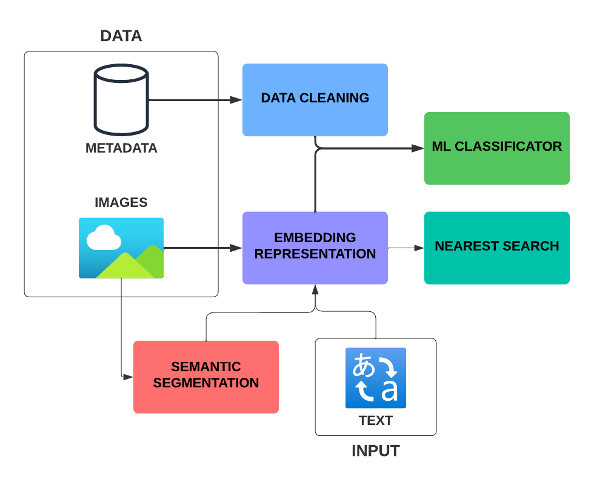

# Design Decoder

Design Decoder is an AI tool with the purpose of making the life of designers easier.

## Introduction

In the fashion industry, accurately logging new garment samples into digital systems is a time-consuming task that requires meticulous attention to detail. This process involves creating a comprehensive product sheet with detailed information about each garment. Automating this process using machine learning (ML) and artificial intelligence (AI) can offer several key benefits:

- Frees up designers' time to focus on their core strength: designing garments, rather than manually entering product data.
- Ensures data quality and consistency for logged information.
- Seamlessly updates the product catalog with garment attributes that will ultimately appear on online stores.

## Objectives

* **Accuracy:** It is crucial that the accuracy of the model is the highest it can be to ensure that designers do not have to spend time correcting errors in the automatically generated product sheets. High accuracy will allow designers to trust the system and focus on their primary tasks, thereby increasing overall productivity and efficiency.

* **Fast Inference Time:** The model should be able to process and classify images quickly to ensure that the system can keep up with the pace of new garment samples being created. This will help in maintaining a smooth workflow without delays.

* **Scalability:** The solution should be scalable to handle a large number of images and metadata entries as the product catalog grows. It should be able to maintain performance and accuracy even with an increasing volume of data.

* **User-Friendly Interface:** The tool should have an intuitive and easy-to-use interface for designers and other users. This includes clear visualizations and straightforward interaction mechanisms to ensure that users can efficiently utilize the tool without extensive training.

* **Robustness:** The model should be robust enough to handle variations in image quality, lighting conditions, and different styles of garments. It should be able to reliably handle images of both clothes and models with clothes on, and generalize well across different types of products and scenarios. It is important that both types of images are correctly labeled to ensure the accuracy and reliability of the system.

## Overview

This project aims to create a model capable of determining the design attributes of a product given a product image and product metadata. The solution leverages the use of a Fashion-pretrained Model (CLIP) for creating the embeddings of the images, and the use of traditional AI models to classify the different products from the images and the data given.

## How we did it

Our application leverages modern ML frameworks and tools:

* **PyTorch** for deep learning and CLIP
* **XGBoost** for gradient boosting
* **OpenCV** for image processing
* Streamlit for web interface
* NumPy and Pandas for data handling
* Scikit-learn for preprocessing

We used PyTorch and CLIP to generate embeddings for the images, which allowed us to capture the visual features of the garments. XGBoost was then used to classify these embeddings along with the metadata to predict the design attributes. OpenCV helped in preprocessing the images to ensure they were in the right format for the model. Streamlit was used to create an interactive web interface for users to upload images and view the predicted attributes. NumPy and Pandas were essential for handling and manipulating the data, while Scikit-learn provided tools for preprocessing and evaluating the model's performance.

